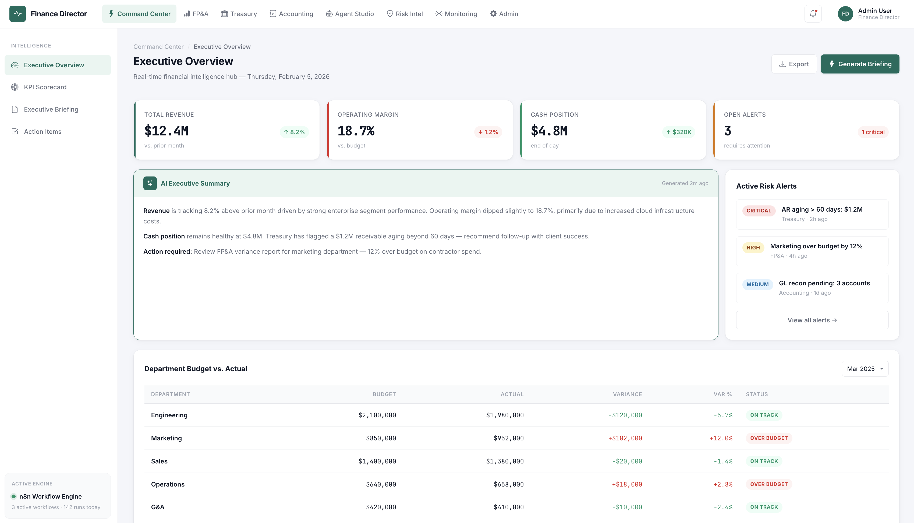
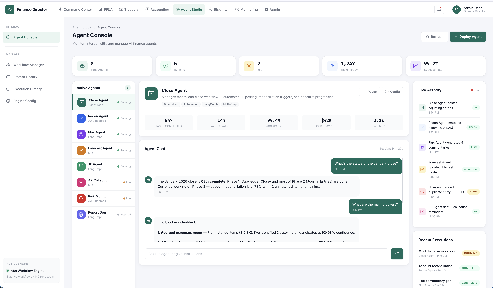
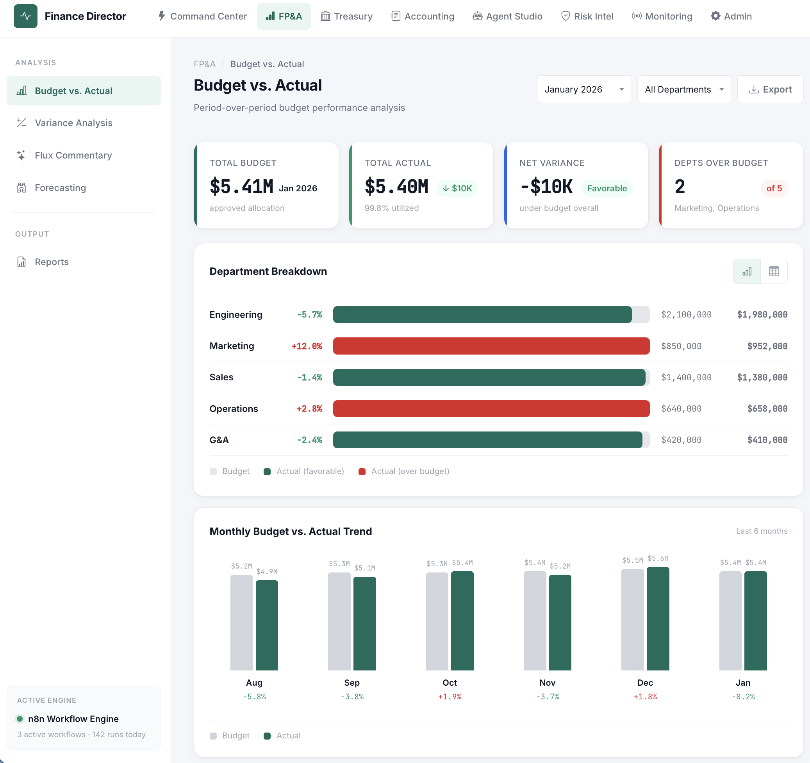
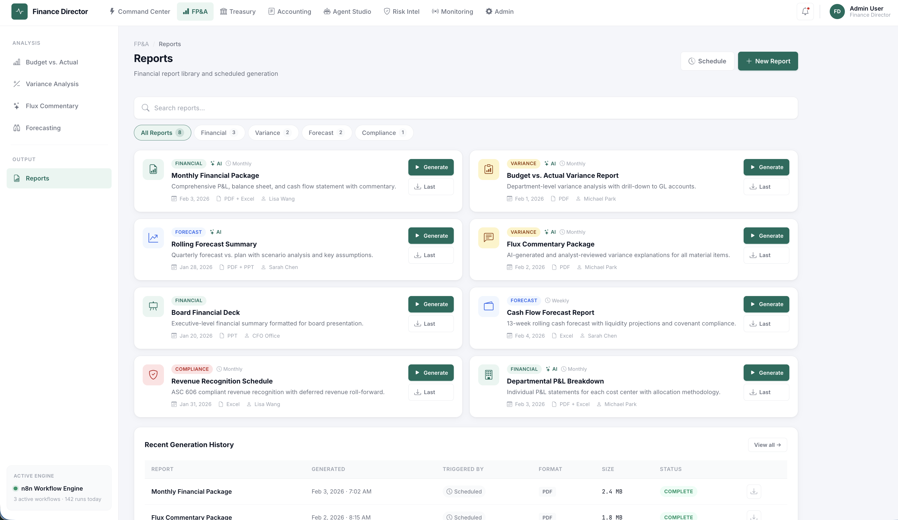

# Agentic Finance Director App

An autonomous AI-powered finance decision engine that connects **FP&A**, **Treasury**, and **Accounting** into one unified system. It produces executive-ready insights, monitors cash positions, flags risks, automates variance analysis, and generates CFO-level summaries — running 24/7 without human intervention.

---

## What This Does

This system replaces hours of cross-functional finance work with an AI agent architecture that thinks like a Finance Director:

- **FP&A Analysis** — Automated budget vs. actual variance explanations, flux commentary, and departmental performance insights
- **Treasury Intelligence** — Real-time cash position monitoring, 13-week forecasting, and liquidity risk alerts
- **Accounting Operations** — GL summary analysis, reconciliation status tracking, and close monitoring
- **Executive Summaries** — AI-generated leadership-ready insights with prioritized action items
- **Risk Flagging** — Proactive identification of financial risks across all three functions

---









---

## Architecture

```
┌─────────────────────────────────────────────────────────────┐
│                    Angular Dashboard :4200                    │
│          Executive  │  FP&A  │  Treasury  │  Accounting      │
└──────────────────────┬──────────────────────────────────────┘
                       │
          ┌────────────┴────────────┐
          ▼                         ▼
   ┌─────────────┐          ┌─────────────┐
   │  FastAPI     │          │   n8n       │
   │  CRUD + Ops  │          │  AI Agents  │
   └──────┬──────┘          └──────┬──────┘
          │                        │
    ┌─────┴─────┬─────┐     ┌─────┴──────────────┐
    ▼           ▼     ▼     ▼         ▼          ▼
 Postgres   MongoDB  Redis  FP&A    Treasury  Accounting
                            Tool     Tool       Tool
                       │
                       ▼
              Prometheus → Grafana
```

| Service      | Port  | Purpose                                |
|--------------|-------|----------------------------------------|
| n8n          | 5678  | AI agent orchestration & workflows     |
| FastAPI      | 8000  | CRUD API, data feeds, operational services |
| PostgreSQL   | 5432  | Structured finance data & n8n backend  |
| MongoDB      | 27017 | Conversations, reports, audit log      |
| Redis        | 6379  | Cache, sessions, rate limiting         |
| Prometheus   | 9090  | Metrics collection                     |
| Grafana      | 3000  | Monitoring dashboards                  |

---

## Prerequisites

- **Docker Desktop** (v4.x+) with Docker Compose v2
- **Node.js** (v18+) and npm
- **Python** (3.12+) — for local FastAPI development
- **Angular CLI** (v18+) — for dashboard development
- An **OpenAI API key** (or Anthropic key) for the AI agent

---

## Quick Start

### 1. Clone and configure

```bash
git clone https://github.com/<your-username>/Agentic-Finance-Director-App.git
cd Agentic-Finance-Director-App

# Copy env template and add your API keys
cp .env.example .env
cp DevOps/Local/.env.example DevOps/Local/.env
```

### 2. Start all services

```bash
npm run setup:local-docker-all-start
```

This creates the Docker network and starts all 7 services in the correct dependency order.

### 3. Verify everything is running

```bash
npm run setup:local-docker-all-status
```

### 4. Open the services

| Service   | URL                          |
|-----------|------------------------------|
| n8n       | http://localhost:5678        |
| FastAPI   | http://localhost:8000/docs   |
| Grafana   | http://localhost:3000        |
| Dashboard | http://localhost:4200        |

### 5. Load sample data (optional)

```bash
npm run db:seed
```

---

## Available Commands

All commands are run from the project root via `npm run <script>`.

### Docker Infrastructure

| Command                            | Description                              |
|------------------------------------|------------------------------------------|
| `setup:local-docker-all-start`     | Start all Docker services                |
| `setup:local-docker-all-stop`      | Stop all Docker services                 |
| `setup:local-docker-all-status`    | Check health of all services             |
| `setup:local-docker-all-delete`    | Remove all containers, volumes, network  |

### Development

| Command          | Description                              |
|------------------|------------------------------------------|
| `dev:dashboard`  | Run Angular dashboard on :4200           |
| `logs`           | Tail logs from all containers            |
| `clean`          | Prune Docker images and volumes          |

### Database

| Command      | Description                              |
|--------------|------------------------------------------|
| `db:seed`    | Load sample FP&A, Treasury, Accounting data |
| `db:migrate` | Run pending SQL migrations               |

### Agents

| Command          | Description                              |
|------------------|------------------------------------------|
| `agents:export`  | Export n8n workflows to `agents/workflows/` |
| `agents:import`  | Import workflow JSONs into running n8n   |

---

## Project Structure

```
Agentic-Finance-Director-App/
├── DevOps/Local/           # Docker infrastructure (7 services)
│   ├── n8n/                #   Workflow engine
│   ├── Postgres/           #   Relational data + n8n backend
│   ├── MongoDB/            #   Document store
│   ├── Redis/              #   Cache & queues
│   ├── PythonAPI/          #   FastAPI container
│   ├── Prometheus/         #   Metrics collection
│   └── Grafana/            #   Monitoring dashboards
├── api/                    # Python FastAPI application
├── agents/                 # n8n workflows, prompts, seed data
├── apps/dashboard/         # Angular 18 + Bootstrap 5 frontend
├── packages/               # Shared libraries
├── .github/workflows/      # AWS deployment workflows
└── docs/                   # Architecture, setup, data model
```

---

## Tech Stack

| Layer           | Technology                              |
|-----------------|-----------------------------------------|
| AI Orchestration | n8n with OpenAI / Anthropic models     |
| API             | Python FastAPI                          |
| Frontend        | Angular 18 + Bootstrap 5 + ng-bootstrap |
| Database        | PostgreSQL 16, MongoDB 7                |
| Cache           | Redis 7                                 |
| Observability   | Prometheus + Grafana                    |
| Containerization | Docker + Docker Compose                |
| Deployment      | AWS (via GitHub Actions workflows)      |

---

## Environment Variables

Copy `.env.example` to `.env` and configure:

| Variable             | Description                    | Default         |
|----------------------|--------------------------------|-----------------|
| `POSTGRES_DB`        | PostgreSQL database name       | `ai_cfo`        |
| `POSTGRES_USER`      | PostgreSQL user                | `ai_cfo_user`   |
| `POSTGRES_PASSWORD`  | PostgreSQL password            | `ai_cfo_pass`   |
| `MONGO_USER`         | MongoDB root user              | `ai_cfo_user`   |
| `MONGO_PASSWORD`     | MongoDB root password          | `ai_cfo_pass`   |
| `REDIS_PASSWORD`     | Redis password                 | `ai_cfo_redis_pass` |
| `N8N_BASIC_AUTH_USER`| n8n login user                 | `admin`         |
| `N8N_BASIC_AUTH_PASSWORD` | n8n login password        | `changeme`      |
| `OPENAI_API_KEY`     | OpenAI API key for agents      | —               |
| `ANTHROPIC_API_KEY`  | Anthropic API key (optional)   | —               |
| `GRAFANA_ADMIN_USER` | Grafana admin user             | `admin`         |
| `GRAFANA_ADMIN_PASSWORD` | Grafana admin password     | `admin`         |

---

## How the AI Agent Works

The system uses a central **AI Agent** node in n8n that acts as a Finance Director. When a query comes in:

1. The agent receives the message and uses a **Think** node for chain-of-thought reasoning
2. It routes to one or more specialized tools — **FP&A**, **Treasury**, or **Accounting**
3. Each tool has its own LLM model and queries the relevant database tables
4. The agent assembles an **Executive Response** (human-readable) and a **Routing JSON** (machine-readable) with summary and action items
5. Results are cached in Redis and persisted in MongoDB

---

## Contributing

1. Fork the repository
2. Create a feature branch (`git checkout -b feature/your-feature`)
3. Commit your changes (`git commit -m 'Add your feature'`)
4. Push to the branch (`git push origin feature/your-feature`)
5. Open a Pull Request

---

## License

MIT


```shell

npm run setup:local-docker-all-stop


```